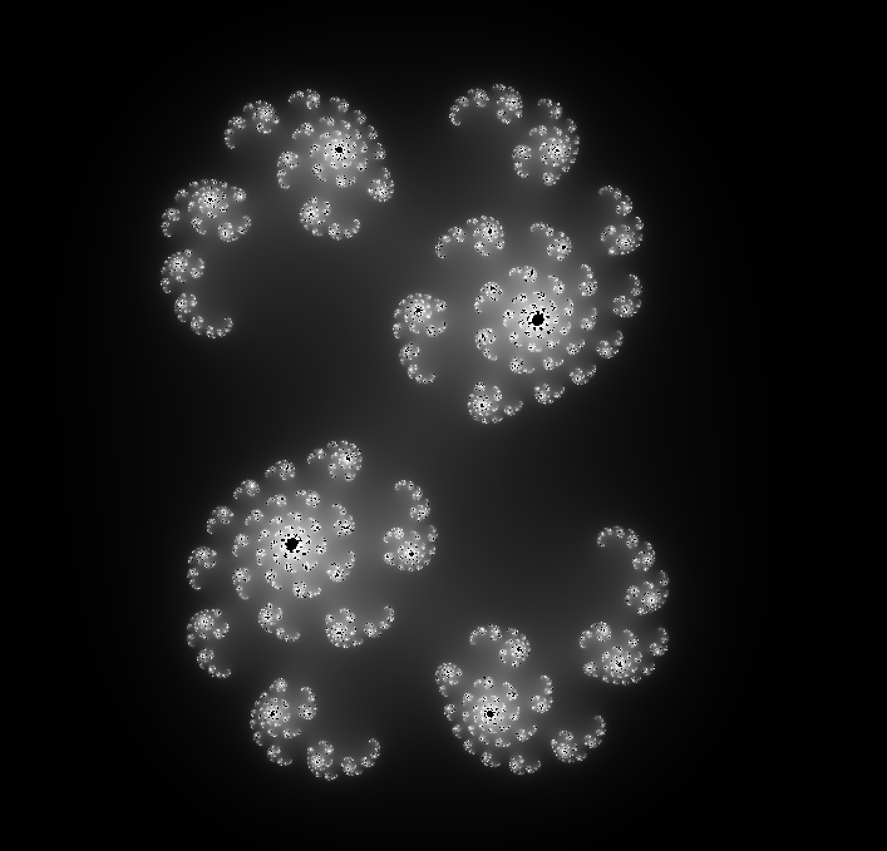

# OpenGL Experiments

This project is an implementation of a Julia set renderer using OpenGL. It demonstrates basic OpenGL concepts such as Vertex Array Objects (VAOs), Vertex Buffer Objects (VBOs), shaders, and user interaction to explore fractal patterns.

## Features

- Real-time rendering of the Julia set.
- Interactive controls to zoom and pan around the fractal.
- Aspect ratio handling for different window sizes.
- Shader-based calculations for fractal generation.

## Demo



## Requirements

- CMake 3.26 or higher
- GLFW 3.3
- A C++17 compatible compiler

## Build and Run

To build and run the project, follow these steps:

```bash
mkdir build
cd build
cmake ..
make
./app
```

## Project Structure

- `src/`: Contains the C++ source files.
- `shaders/`: Contains GLSL shaders for rendering the Mandelbrot set.
- `external/`: External dependencies, including GLAD for OpenGL function loading.
- `CMakeLists.txt`: CMake configuration file.

## Controls

- Use arrow keys to pan around the fractal.
- `W`, `A`, `S`, `D` keys to adjust the fractal parameters.
- `P` to zoom in, `M` to zoom out.

## Shaders

The project uses GLSL shaders for rendering:

- Vertex Shader: Processes vertex data for the fullscreen quad.
- Fragment Shader: Performs the Julia set calculations and color mapping.

## Acknowledgements

This project was created to explore OpenGL and fractal rendering. It serves as a basic introduction to using OpenGL for graphical computations.
